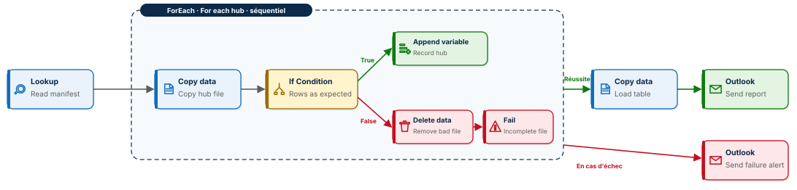
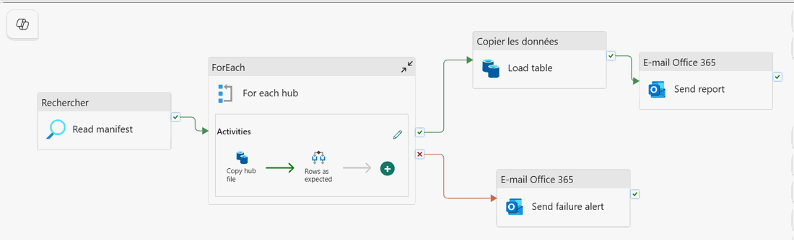
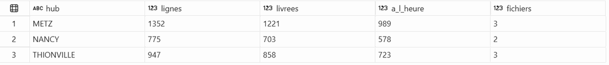

# 🔁 Fabric Pipeline Express 2 : lire, boucler, vérifier, arrêter

Un pipeline Microsoft Fabric Data Factory piloté par un manifeste. Il lit la liste des fichiers du jour, les copie un par un, vérifie chacun, retire tout fichier incomplet, reconstruit la table Delta et envoie le compte rendu. Dix activités, huit types d'activité, aucune ligne de code, et un pipeline qui préfère finir en échec plutôt que de charger une donnée fausse.

**Guide PDF de 7 pages inclus** : [`Pipeline_Fabric_Guide.pdf`](Pipeline_Fabric_Guide.pdf). Chaque activité, chaque champ, chaque expression, et les chiffres à retrouver à l'unité près.



## 📸 Aperçu

Le pipeline tel qu'il apparaît dans Fabric, puis la vérification dans le point de terminaison SQL du lakehouse.





## 🎯 Résultats clés

| Indicateur | Valeur |
|---|---|
| Activités dans le pipeline | 10 (Lookup, ForEach, Copy data ×2, If Condition, Append variable, Delete data, Fail, Office 365 Outlook ×2) |
| Lignes de code | 0 |
| Noms de fichiers écrits dans le pipeline | 0, tout vient du manifeste |
| Fichiers vérifiés sur trois journées | 9, dont 1 refusé |
| Lignes dans la table `deliveries` après la dernière exécution | 3 074 |
| Relance d'une journée déjà chargée | 0 doublon |
| Livraisons effectuées / à l'heure | 2 782 (90,5 %) / 2 290 (74,5 %) |

## 💼 Impact métier

Trois hubs logistiques déposent chaque jour leur fichier de livraisons. Tôt ou tard, l'un d'eux arrive tronqué. Ce pipeline ne charge jamais un fichier incomplet : il le retire de la zone brute, termine les autres hubs, se met en échec avec un message qui nomme le hub, et laisse la table intacte. Ajouter un hub demain ne demande aucune modification dans Fabric : une ligne de plus dans le manifeste suffit.

## 📝 Résumé

Le pipeline `PL_Deliveries_Express` reçoit une date en paramètre. Un Lookup lit `manifest_<date>.csv` sur GitHub. Un ForEach séquentiel parcourt ses lignes : pour chaque hub, un Copy dépose le fichier dans `Files/raw/deliveries/load_date=<date>/hub=<hub>/`, puis une If Condition compare `rowsCopied` au minimum attendu. Branche True, une variable mémorise « hub : n lignes ». Branche False, un Delete data retire le fichier et un Fail lève l'erreur. Après la boucle, un second Copy lit toute la zone brute par chemin générique, ajoute la colonne `$$FILEPATH` et remplace la table `deliveries`. Deux activités Outlook couvrent la réussite et l'échec.

## 🔁 Pipeline

| Activité | Type | Rôle |
|---|---|---|
| `Read manifest` | Lookup | Lit `manifest_<date>.csv` et renvoie ses lignes |
| `For each hub` | ForEach, séquentiel | Parcourt `@activity('Read manifest').output.value` |
| `Copy hub file` | Copy data | Copie `@{item().file}` vers la zone brute datée et partitionnée par hub, avec la colonne `load_date` ajoutée |
| `Rows as expected` | If Condition | `@greaterOrEquals(activity('Copy hub file').output.rowsCopied, int(item().min_rows))` |
| `Record hub` | Append variable, branche True | Ajoute « hub : n lignes » à `hub_rows` |
| `Remove bad file` | Delete data, branche False | Retire le fichier incomplet de la zone brute |
| `Incomplete file` | Fail, branche False | Met l'exécution en échec avec le hub en message |
| `Load table` | Copy data | Chemin générique `raw/deliveries/*/*` + `$$FILEPATH`, remplace la table `deliveries` |
| `Send report` / `Send failure alert` | Office 365 Outlook | Fil vert pour la réussite, fil rouge pour l'échec |

## 🧬 Traçabilité

```
GitHub : data/manifest_<date>.csv
   │  Lookup Read manifest
   ▼
ForEach For each hub (séquentiel)
   │  Copy hub file : data/deliveries_<HUB>_<date>.csv
   ▼
LH_Deliveries / Files / raw / deliveries / load_date=<date> / hub=<HUB> / deliveries.csv
   │  If Condition Rows as expected
   ├──True──▶ Append variable Record hub
   └──False─▶ Delete data Remove bad file ──▶ Fail Incomplete file
   │
   ▼ (fil vert)
Copy data Load table : raw/deliveries/*/*/deliveries.csv + colonne source_file
   ▼
LH_Deliveries / Tables / deliveries            reconstruite à chaque exécution
   ▼
Outlook Send report          (fil rouge depuis la boucle : Outlook Send failure alert)
```

## 🏗️ Architecture

Un lakehouse unique, `LH_Deliveries`, avec une zone brute dans Files et une table Delta dans Tables. Trois principes structurent le projet :

1. **Piloté par un manifeste** : la liste des fichiers vit dans un CSV, pas dans le pipeline.
2. **Chaque fichier répond de lui-même** : le nombre de lignes copiées est comparé au minimum attendu ; un fichier incomplet est retiré avant d'atteindre la table.
3. **Une table toujours juste** : la table est reconstruite depuis la zone brute entière ; relancer ne duplique jamais.

## ▶️ Les quatre exécutions

| Exécution | `load_date` | Ce qui se passe | Table `deliveries` |
|---|---|---|---|
| 1 | 2026-10-05 | 437 + 384 + 307 lignes copiées, e-mail de compte rendu | 1 128 |
| 2 | 2026-10-06 | 467 + 391 + 305 lignes copiées | 2 291 |
| 3 | 2026-10-07 | Nancy n'a que 48 lignes : fichier retiré, boucle en échec, e-mail d'alerte | 2 291, intacte |
| 4 | 2026-10-05 | Relance d'une journée déjà chargée | 3 074, aucun doublon |

## 📦 Jeu de données

```
data/
├── manifest_2026-10-05.csv            3 fichiers attendus
├── manifest_2026-10-06.csv            3 fichiers attendus
├── manifest_2026-10-07.csv            3 fichiers attendus, dont 1 incomplet
├── deliveries_METZ_2026-10-05.csv         437 lignes
├── deliveries_NANCY_2026-10-05.csv        384 lignes
├── deliveries_THIONVILLE_2026-10-05.csv   307 lignes
├── deliveries_METZ_2026-10-06.csv         467 lignes
├── deliveries_NANCY_2026-10-06.csv        391 lignes
├── deliveries_THIONVILLE_2026-10-06.csv   305 lignes
├── deliveries_METZ_2026-10-07.csv         448 lignes
├── deliveries_NANCY_2026-10-07.csv         48 lignes, volontairement incomplet
└── deliveries_THIONVILLE_2026-10-07.csv   335 lignes
```

Une ligne par colis : identifiant, hub, horodatage, chauffeur, ville, code postal, service, poids, distance, durée, statut, respect du délai. Données fictives, conçues pour l'exercice.

## 🚀 Reproduire l'exercice

1. Créer un lakehouse `LH_Deliveries`.
2. Construire `PL_Deliveries_Express` en suivant `Pipeline_Fabric_Guide.pdf`. La connexion HTTP pointe sur `https://raw.githubusercontent.com/abdoulhamiddiallo/fabric-pipeline-express-2/main/data/`.
3. Exécuter avec `load_date = 2026-10-05`, `2026-10-06`, `2026-10-07`, puis à nouveau `2026-10-05`, et retrouver les chiffres du tableau ci-dessus.
4. Vérifier dans le point de terminaison SQL :

```sql
SELECT hub, COUNT(*) AS lignes,
       SUM(CASE WHEN status = 'delivered' THEN 1 ELSE 0 END) AS livrees,
       SUM(CASE WHEN on_time = 'yes' THEN 1 ELSE 0 END)      AS a_l_heure,
       COUNT(DISTINCT source_file)                           AS fichiers
FROM deliveries GROUP BY hub ORDER BY hub;
```

| hub | lignes | livrees | a_l_heure | fichiers |
|---|---|---|---|---|
| METZ | 1 352 | 1 221 | 989 | 3 |
| NANCY | 775 | 703 | 578 | 2 |
| THIONVILLE | 947 | 858 | 723 | 3 |

## 🧰 Stack technique

Microsoft Fabric Data Factory · Lakehouse et Delta Lake · Office 365 Outlook · Point de terminaison SQL

## ✅ Conclusion

Un pipeline n'a pas besoin de code pour être rigoureux. Un manifeste, une boucle, une condition et une action d'échec suffisent pour qu'un fichier incomplet ne franchisse jamais la porte de la table.

## 💭 Dernier mot

Le bon pipeline n'est pas celui qui réussit toujours. C'est celui qui sait dire non, proprement, et vous le dire.

---

Abdoul Hamid Diallo · Microsoft Data & AI Engineer · Microsoft Certified DP-600, DP-700, PL-300, AI-102, DP-100 · [LinkedIn](https://www.linkedin.com/in/abdoul-hamid-diallo-fabric-data-engineer/)
